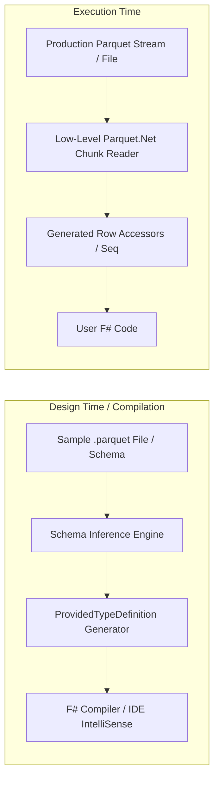

# 01 - Architecture Plan: Parquet.TypeProvider

## 1. Overview

`Parquet.TypeProvider` is an F# Type Provider that generates strongly-typed representations of Apache Parquet schemas at compile time. It enables F# developers to seamlessly read and query Parquet datasets with full static type checking, auto-completion, and optimized execution.



---

## 2. Type Provider SDK Architecture

Following F# Type Provider best practices and the `FSharp.TypeProviders.SDK`, the project is cleanly divided into two assemblies:

### A. Design-Time Component (`Parquet.TypeProvider.DesignTime`)
* **Role**: Runs inside the IDE (Visual Studio, Rider, VS Code / Ionide) and the F# compiler (`fsc.exe`).
* **Responsibilities**:
  1. Locates the sample Parquet file or schema specification from the static parameter.
  2. Parses the Parquet file metadata (`FileMetaData`, `Schema`, `Thrift` schema fields) using `Parquet.Net` metadata readers.
  3. Uses `ProvidedTypeDefinition`, `ProvidedProperty`, and `ProvidedMethod` to generate the erased types.
  4. Emits runtime quotation expressions (`<@@ ... @@>`) that wire property getters directly to underlying row index arrays.

### B. Runtime Component (`Parquet.TypeProvider.Runtime`)
* **Role**: Deployed with the application and referenced at runtime.
* **Responsibilities**:
  1. `ParquetReaderCore`: Wraps `ParquetReader` and `ParquetRowGroupReader` from `Parquet.Net`.
  2. `ParquetRowContext`: Lightweight column storage representing decoded row-group batches in memory.
  3. `ParquetSequence`: Implements `seq<'Row>` and `IAsyncEnumerable<'Row>` over batched row groups.

---

## 3. Memory & Performance Strategy

1. **Erased Types**:
   * Types are erased at runtime to avoid code bloat. Row objects are represented internally by a lightweight context or struct wrapping column arrays:
     ```fsharp
     type ParquetRowContext = {
         RowIndex: int
         Columns: obj[]
     }
     ```
2. **Columnar Batching over Row-by-Row Decoding**:
   * Instead of reading row-by-row with reflection, `Parquet.Net` reads an entire column chunk into a contiguous typed array (`int[]`, `string[]`, `DateTime[]`, etc.).
   * The generated row property accessor simply performs an array index lookup:
     ```fsharp
     // Property getter expression emitted by design-time provider:
     <@@ fun (ctx: ParquetRowContext) -> (ctx.Columns.[columnIdx] :?> 'FieldType[])[ctx.RowIndex] @@>
     ```
3. **Row-Group Streaming**:
   * Reading does not require buffering the entire file. When iterating via `seq` or `IAsyncEnumerable`, row groups are loaded, processed, and released sequentially.

---

## 4. Key Static Parameters

The type provider accepts the following static parameters:

```fsharp
type Dataset = ParquetProvider<
    Sample = "path/to/sample.parquet",      // Local path or URL to sample file
    Schema = "",                            // Optional inline schema definition
    PreferOption = true,                    // Map nullable columns to 'T option (vs null)
    BatchSize = 10000                       // Default row group batch size
>
```
