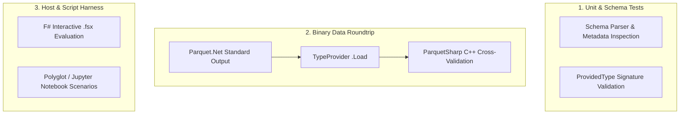

# 05 - Testing Strategy & Benchmarking System

This document outlines the testing machinery and performance benchmark suite for `Parquet.TypeProvider`, incorporating best practices and benchmark automation from [`Parquet.SourceGenerator`](file:///Users/ryankelly/code/personal/Parquet.SourceGenerator).

---

## 1. Testing Machinery

Because an F# Type Provider generates types inside the compiler host, testing requires three distinct layers:

### A. Design-Time Provided Type Verification
Using `FSharp.TypeProviders.SDK` test helpers to assert that `ProvidedTypeDefinition` and generated properties match the inferred Parquet schema without executing runtime loads.

### B. Binary Compatibility & Cross-Validation
- Reading test parquet files generated by `Parquet.Net` v6.
- Reading parquet files generated by Python `pyarrow` / `pandas` and C++ `ParquetSharp` to ensure full specification compliance (timestamps, nullability, decimals, strings).

### C. F# Interactive (`.fsx`) Script Testing
Ensuring that `#r "nuget: ..."` loads cleanly out-of-process in FSI (F# Interactive), Rider, Visual Studio, and Ionide.

---

## 2. Benchmarking Architecture (`BenchmarkDotNet`)

Benchmarking is located in `benchmarks/Parquet.TypeProvider.Benchmarks` and models the multi-scale methodology of `Parquet.SourceGenerator`:

### Multi-Scale Workloads
- **Small Batches**: 1,000 rows (latency and per-record overhead).
- **Medium Batches**: 10,000 to 100,000 rows (ETL and memory GC pressure).
- **Large Batches**: 1,000,000 rows (streaming row group throughput).

### Benchmark Comparison Matrix

| Benchmark Scenario | Baseline 1 (Reflection) | Baseline 2 (F# Mapper) | Target: `Parquet.TypeProvider` |
| :--- | :--- | :--- | :--- |
| **Row Iteration (`seq<'Row>`)** | `ParquetSerializer.DeserializeAsync` | `Parquet.FSharp` (Reflection) | Direct columnar array indexing |
| **Direct Column Array Read** | N/A | Manual `ParquetReader` loop | `Orders.Columns.Amount(...)` |
| **Memory Allocation** | Baseline | Baseline | Zero-copy `ArrayPool` chunking |

### Benchmark Automation & CI Reports
Benchmarks are configured with `[MemoryDiagnoser]` and `[Orderer(SummaryOrderPolicy.FastestToSlowest)]`. CI runs update the benchmark markdown summary block in the `README.md` automatically via GitHub Actions.
