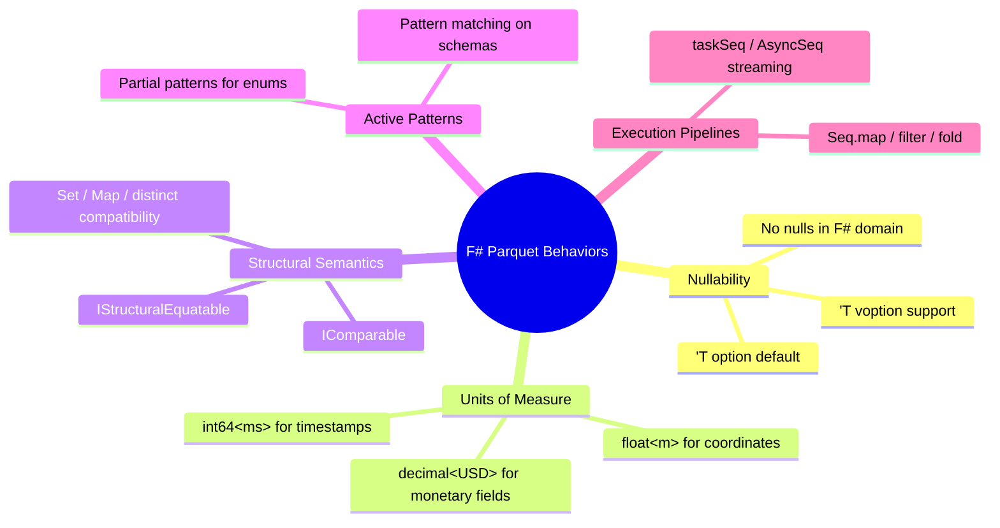
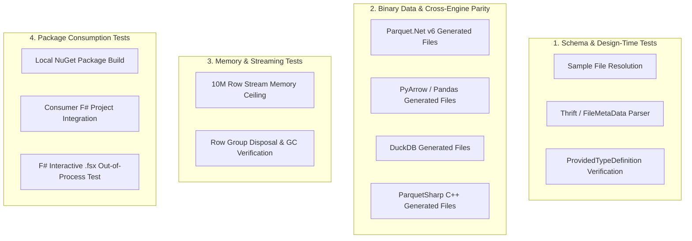

# 06 - Testing, Consumption, and F# Language Integration Plan

This document details the test strategy, consumption validation, performance benchmarking, and F#-specific language features for `Parquet.TypeProvider`.

---

## 1. F#-Bespoke Language Behaviors

F# data engineers and developers expect idioms distinct from C# object-oriented paradigms. `Parquet.TypeProvider` natively integrates with the F# type system:



### A. Idiomatic Option Handling (`'T option` & `'T voption`)
* **Parquet `OPTIONAL` Columns:** Automatically mapped to F# `Some('value)` or `None`.
* **Zero-allocation `voption`:** For tight loops, users can specify `PreferStructOption = true` to emit `ValueOption<'T>` to avoid heap allocations.

### B. Units of Measure Support
* **Timestamp Precision:** Timestamps and duration fields can be tagged with measure units:
  ```fsharp
  [<Measure>] type ms
  [<Measure>] type us
  [<Measure>] type ns
  [<Measure>] type USD
  ```
* **Compile-Time Type Safety:** Prevents accidental mathematical operations mixing milliseconds with seconds or mismatched currencies.

### C. Structural Equality & Comparisons
* Generated erased row instances implement `IStructuralEquatable` and `IComparable`.
* Rows can be directly placed into F# `Set`, used as keys in `Map`, or deduplicated using `Seq.distinct`.

### D. Pipeline & Functional Combinators
* Direct integration with `Seq`, `Array`, and `List` modules:
  ```fsharp
  let highValueOrders =
      Orders.Load("orders.parquet")
      |> Seq.filter (fun o -> o.Amount > 1000.0m<USD>)
      |> Seq.groupBy (fun o -> o.CustomerId)
      |> Seq.map (fun (cid, group) -> cid, Seq.sumBy (fun o -> o.Amount) group)
  ```

---

## 2. Multi-Tier Testing Machinery



### Layer 1: Schema & Provided Type Unit Tests (`tests/Parquet.TypeProvider.Tests`)
- Validates all 13 core Parquet physical and logical types (Boolean, Int32, Int64, Float, Double, Decimal, Guid, String, Byte[], Date, Time, Timestamp, List).
- Verifies compiler diagnostic reporting for missing files or corrupted footers.

### Layer 2: Cross-Engine Binary Parity Tests
- Tests ingestion against standard files produced by:
  1. **Python `pyarrow` / `fastparquet`**
  2. **DuckDB**
  3. **Apache Spark**
  4. **ParquetSharp (C++ Arrow)**

### Layer 3: Memory & Resource Leak Tests
- Streams a 10-million row dataset across 1,000 row groups.
- Asserts that memory remains constant (`GC.GetTotalMemory(true)` delta < 50MB) proving row groups are streamed and discarded rather than retained.

---

## 3. End-to-End Package Consumption Testing

To ensure the packaged NuGet asset functions seamlessly in consumer applications and developer tooling:

### A. Local Packaging Pipeline
1. Output `.nupkg` into local `./artifacts` directory via `dotnet pack`.
2. Configure `test/Parquet.TypeProvider.ConsumerApp` with a local `nuget.config`:
   ```xml
   <configuration>
     <packageSources>
       <add key="local-artifacts" value="../../artifacts" />
     </packageSources>
   </configuration>
   ```

### B. IDE & Tooling Verification Matrix
- **F# Interactive (`dotnet fsi`):** Script `#r "nuget: Parquet.TypeProvider, 0.0.1"` executes cleanly.
- **Rider / Ionide / Visual Studio:** Verifies type completion, parameter info, and tooltips load without design-time host lockups.

---

## 4. Multi-Scale Benchmarking Suite

Located in `benchmarks/Parquet.TypeProvider.Benchmarks` utilizing **BenchmarkDotNet**:

### Multi-Scale Testing (1K, 10K, 100K, 1,000,000 Rows)

```mermaid
gantt
    title Benchmark Comparison Workloads
    dateFormat X
    axisFormat %s
    section 1K Rows (Micro-latency)
    Baseline vs TypeProvider : 0, 1000
    section 100K Rows (ETL Batch)
    Memory & Throughput : 0, 100000
    section 1M Rows (High-Throughput)
    Streaming Execution : 0, 1000000
```



### Benchmarked Candidates:
1. **`ParquetSerializer.DeserializeAsync`** (Parquet.Net Reflection Baseline).
2. **`Parquet.FSharp`** (F# Runtime Reflection Mapper).
3. **Manual `ParquetReader` Loop** (Hand-optimized raw C# / F# baseline).
4. **`Parquet.TypeProvider` `seq<Row>`** (Idiomatic row traversal).
5. **`Parquet.TypeProvider` `Columns.*`** (Direct columnar array extraction).

### Measured Metrics:
- Mean Execution Time (ms / μs).
- Memory Allocated per Operation (MB / KB).
- Gen 0, Gen 1, Gen 2 GC Collections.

---

## 5. Planned Sample Applications

1. **`samples/Exploration.fsx`**: Interactive analytics notebook script.
2. **`samples/StreamingETL/`**: Multi-gigabyte streaming pipeline using `IAsyncEnumerable`.
3. **`samples/UnitsOfMeasure/`**: Financial/telemetry modeling with strongly-typed units (`<ms>`, `<USD>`).
