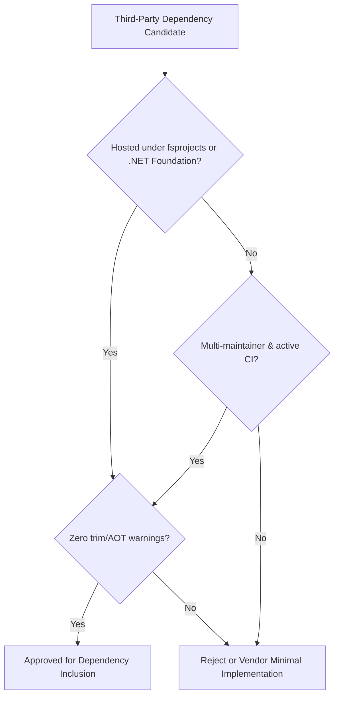

# 07 - F# Software Foundation Ecosystem & Dependency Standards

This document establishes the architectural standards, language baselines, and rationale for external dependencies in `Parquet.TypeProvider`, specifically emphasizing the role of the **F# Software Foundation (FSSF)** and the `fsprojects` community ecosystem.

---

## 1. Language Baseline: F# 6.0+

`Parquet.TypeProvider` establishes **F# 6.0** (shipped with .NET 6 / `FSharp.Core >= 6.0.0`) as the minimum language baseline.

### Rationale for F# 6.0 Baseline:
1. **Native `task { ... }` Computation Expressions**:
   - Starting in F# 6.0, `task { ... }` is built directly into the core language compiler via *resumable code*.
   - Generates high-performance, low-allocation struct state machines without requiring legacy computation expression shims (e.g., `TaskBuilder.fs` or `Ply`).
2. **Direct Interoperability with .NET Asynchronous APIs**:
   - `Parquet.Net` v6 low-level readers (`ParquetReader.CreateAsync`, `groupReader.ReadAsync`) return standard .NET `Task<'T>`, which are awaited with native `let!` / `do!` in F# 6+ with zero overhead.

---

## 2. The F# Software Foundation (`fsprojects`) Governance

The [F# Software Foundation](https://fsharp.org/) is the independent, non-profit organization dedicated to advancing the F# language and ecosystem. Projects hosted under the [`fsprojects`](https://github.com/fsprojects) GitHub organization adhere to specific community governance standards:

1. **Long-Term Maintainability**: Not tied to single-author abandonment; shared maintainer access across the core F# community.
2. **First-Class Compiler Compatibility**: Built to evolve in lockstep with `FSharp.Core` and the F# Compiler Service (`FCS`).
3. **Idiomatic Language Design**: Built specifically for F# idioms (algebraic data types, computation expressions, immutability, pipeline operators).

---

## 3. Technical Evaluation of Foundation Dependencies

### `FSharp.Control.TaskSeq` (`fsprojects/FSharp.Control.TaskSeq`)
* **Role in `Parquet.TypeProvider`**: Powers the non-blocking asynchronous streaming engine (`readRowsStream` / `loadFromFileAsync` / `AsyncLoad`).
* **Why it was selected**:
  - **The Missing Piece in `FSharp.Core`**: While F# 6.0 introduced native `task { ... }` for scalar tasks (`Task<'T>`), it did not introduce a native `taskSeq` builder for asynchronous streams (`IAsyncEnumerable<'T>`).
  - **Zero OS Thread Blocking**: Completely eliminates the anti-pattern of calling `.GetAwaiter().GetResult()` inside sequence expressions.
  - **Standard Interface**: Produces and consumes standard .NET `IAsyncEnumerable<'T>`, ensuring seamless interop with ASP.NET Core streaming, channels, and cloud SDKs.

### `FSharp.TypeProviders.SDK` (`fsprojects/FSharp.TypeProviders.SDK`)
* **Role in `Parquet.TypeProvider`**: Provides the type generation and compiler infrastructure for `Parquet.TypeProvider.DesignTime`.
* **Why it was selected**:
  - The official, canonical framework maintained by the F# community for creating generative and erased Type Providers.
  - Manages design-time vs. runtime assembly separation, caching, and quotation tree generation.

---

## 4. Dependency Selection Matrix & Policy

To guarantee enterprise stability and prevent dependency bloat, all dependencies must meet these criteria:

| Dependency | Category | Governance | Purpose |
| :--- | :--- | :--- | :--- |
| **`Parquet.Net`** | Core Engine | Managed .NET / AloneGuid | Low-level Parquet format chunk reader & writer |
| **`FSharp.TypeProviders.SDK`** | Design-Time SDK | F# Software Foundation (`fsprojects`) | Type Provider compiler infrastructure |
| **`FSharp.Control.TaskSeq`** | Async Streaming | F# Software Foundation (`fsprojects`) | `taskSeq { ... }` computation expressions |
| **`BenchmarkDotNet`** | Benchmarks | .NET Foundation | Multi-scale performance baseline verification |
| **`xUnit`** | Test Framework | .NET Foundation | Automated unit and integration testing |

---

## 5. Guidelines for Future F# Extension Packages

When extending `Parquet.TypeProvider` (e.g., adding railway-oriented error handling, cancellable tasks, or property testing), priority is given to:
1. **Error Handling**: [`FsToolkit.ErrorHandling`](https://github.com/demystifyfp/FsToolkit.ErrorHandling) (`taskResult { ... }`, `taskOption { ... }`).
2. **Cancellable Async**: [`IcedTasks`](https://github.com/TheAngryByrd/IcedTasks) (`cancellableTask { ... }`).
3. **Property Testing**: [`FsCheck`](https://github.com/fscheck/FsCheck) (`fsprojects`).
